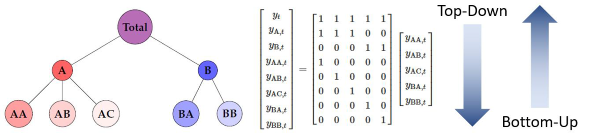

# Bachelorarbeit „Effiziente Verteilung von Vorhersageergebnissen in einem hierarchischen Prognosemodell“

# Efficient Distribution of Forecast Results in a Hierarchical Prediction Model

This repository contains the implementation and research conducted for my bachelor thesis on hierarchical time series forecasting models. The project focuses on developing efficient methods for distributing forecast results across different hierarchical levels while maintaining forecast accuracy and reducing computational costs.

## Project Overview

The thesis investigates hierarchical forecasting models that are crucial for information processing in business environments. These models play a vital role in planning and decision-making across various organizational levels and need to be precise, consistent, and efficiently designed to minimize creation costs.

### Key Features

- Implementation of various forecast reconciliation methods in R
- Efficient top-down distribution algorithms
- Cost optimization while maintaining forecast quality
- Hierarchical data structure handling using S-matrices

## Methods Implemented

### 1. Top-Down Method
- Custom distribution algorithm written in R
- Calculation of historical proportions
- Disaggregation of forecast values
- Determination of average values at the lowest level
- Reconciliation of forecasts using bottom-up method
- Uses aggregation matrix as a blueprint for efficient distribution

### 2. Combined Conditional Coherent (CCC) Method
- Focus on two-level hierarchy coordination
- Utilizes specific elementary 2-level hierarchies within the overall structure
- Efficient distribution to the lowest level without extensive calculations
- Improved results through better approximation of base forecast values

## Results

- Achieved 41% cost reduction while maintaining forecast accuracy
- Top-Down method shows comparable forecast accuracy to reference method
- CCC approach results vary based on base forecast value accuracy
- Successfully demonstrated efficient forecast distribution while maintaining quality

## Key Achievements

- Cost Efficiency: 41% reduction in computational costs
- Quality Maintenance: Preserved forecast accuracy despite reduced calculations
- Scalable Solution: Applicable across different hierarchical levels
- Practical Implementation: Complete R-based solution

## Technical Details

The project utilizes:
- R programming language for implementation
- S-matrices for defining hierarchical relationships
- Custom reconciliation algorithms
- Time series analysis tools

## Project Structure

The repository includes:
- Implementation code in R
- Documentation of methods
- Test results and comparisons
- Example hierarchical structures
- Performance metrics

## Future Development

Potential areas for further development include:
- Integration with other forecasting methods
- Performance optimization
- Additional hierarchical structures
- Extended validation scenarios

---

This research emphasizes the importance of developing efficient and accurate forecasting methods that are not only precise and consistent but also cost-effective, meeting the growing demands of modern, data-driven business environments.